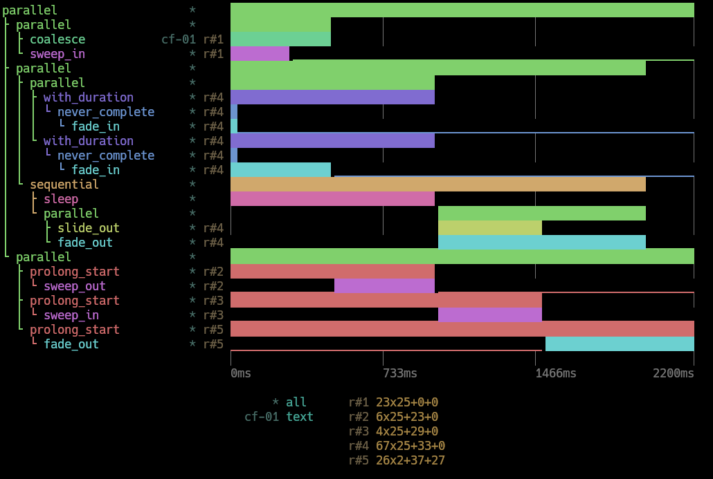

# Changelog

### Added
- `sendable` feature: Enables the `Send` trait for effects, shaders, and associated parameters. This allows effects to
be safely transferred across thread boundaries. Note that enabling this feature requires all `Shader` implementations
to be `Send`, which may impose additional constraints on custom shader implementations.

## tachyonfx 0.6.0 - 2024-09-07

This release introduces a lot of breaking changes in the form of added and removed parameters.
Sorry for any inconvenience this may cause, I'll try to tread more carefully in the future.

### Added
- New "std-duration" feature to opt-in to using `std::time::Duration`, which is the same behavior as before.
- New `tachyon::Duration` type: a 4-byte wrapper around u32 milliseconds. When the "std-duration" feature is enabled,
  it becomes an alias for the 16-byte `std::time::Duration`.

### Changed
- Replaced `rand` crate dependency with a fast `SimpleRng` implementation.
- `render_as_ansi_string()` produces a more compact output by reducing redundant ANSI escape codes.

### Breaking
- `tachyonfx::Duration` is now the default duration type.
- Replace usage of `std::time::Duration` with `tachyonfx::Duration`.
- `fx::sweep_in`, `fx::sweep_out`, `fx::slide_in`, `fx::slide_out`: added `randomness` parameter.
- `fx::dissolve`, `fx::coalesce`: removed `cycle_len` parameter, as cell visibility is recalculated on the fly.
- `fx::sequence`, `fx::parallel`: now parameterized with `&[Effect]` instead of `Vec<Effect>`.

### Deprecated
- `EffectTimeline::from` is deprecated in favor of `EffectTimeline::builder`. 

## tachyonfx 0.5.0 - 2024-08-21

The effect timeline widget visualizes the composition of effects. It also supports rendering the
widget as an ansi-escaped string, suitable for saving to a file or straight to `println!()`.

### Added
- `fx::delay()`: delays the start of an effect by a specified duration.
- `fx::offscreen_buffer()`: wraps an existing effect and redirects its rendering
  to a separate buffer.  This allows for more complex effect compositions and can
  improve performance for certain types of effects.
- `fx::prolong_start`: extends the start of an effect by a specified duration.
- `fx::prolong_end`: extends the end of an effect by a specified duration.
- `fx::translate_buf()`: translates the contents of an auxiliary buffer onto the main buffer.
- `widget::EffectTimeline`: a widget for visualizing the composition of effects.
- `EffectTimeline::save_to_file()`: saves the effect timeline to a file.
- `BufferRenderer` trait: enables rendering of one buffer onto another with offset support.
  This allows for more complex composition of UI elements and effects.
- fn `blit_buffer()`: copies the contents of a source buffer onto a destination buffer with a specified offset.
- fn `render_as_ansi_string()`: converts a buffer to a string containing ANSI escape codes for styling.
- new example: `fx-chart`.

### Breaking
- Shader trait now requires `name()`, `timer()` and `as_effect_span()` methods.
- `ratatui` updated to 0.28.0. This is also the minimum version required for tachyonfx.

## tachyonfx 0.4.0 - 2024-07-14

### Added
- `CellFilter::PositionFn`: filter cells based on a predicate function.
- `EffectTimer::durtion()` is now public.
- `fx::slide_in()` and `fx::slide_out()`: slides in/out cells by "shrinking" the cells horizontally or
  vertically along the given area.
- `fx::effect_fn_buf()`: to create custom effects operating on a `Buffer` instead of `CellIterator`.
- `Shader::reset`: reinitializes the shader(*) to its original state. Previously, the approach was to
  clone the shader from a copy of the original instance, occasionally resulting in unintended behavior
  when certain internal states were expected to persist through resets.

*: _Note that "shader" here is used loosely, as no GPU is involved, only terminal cells._

### Breaking
- `fx::resize_area`:  signature updated with `initial_size: Size`, replacing the u16 tuple.

### Fixed
- `fx::translate()`: translate can now move out-of-bounds.
- `fx::translate()`: hosted effects with extended duration no longer end prematurely.
- `fx::effect_fn()`: effect state now correctly resets between iterations when using `fx::repeat()`, `fx::repeating()`
  and `fx::ping_pong()`. 
- `fx::resize_area()`: fixed numerous problems.

## tachyonfx 0.3.0 - 2024-06-30

### Changed
- `fx::effect_fn()`: updated the function signature to include an initial state parameter and `ShaderFnContext`
  context parameter. The custom effect closure now takes three parameters: mutable state, `ShaderFnContext`, and a
  cell iterator.
- `ratatui` updated to 0.27.0. This is also the minimum version required for tachyonfx.

## tachyonfx 0.2.0 - 2024-06-23

### Added
- `fx::effect_fn()`: creates custom effects from user-defined functions.
- Add `CellFilter::AnyOf(filters)` and `CellFilter::NoneOf(filters)` variants.
- Implemented `ToRgbComponents` trait for `Color` to standardize extraction of RGB components.

### Fixed
- `fx::translate()`: replace `todo!()` in cell_selection().
- 16 and 256 color spaces no longer output black when interpolating to a different color.

## tachyonfx 0.1.0 - 2024-06-20

Initial release of the library.
