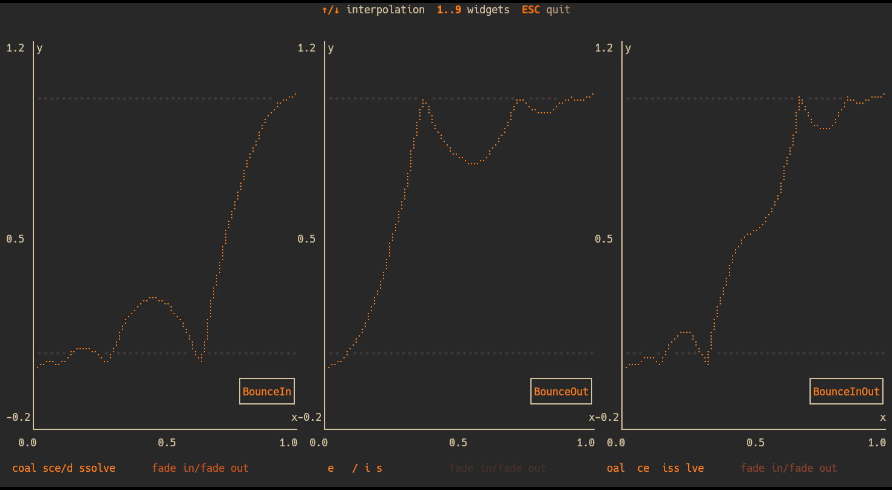
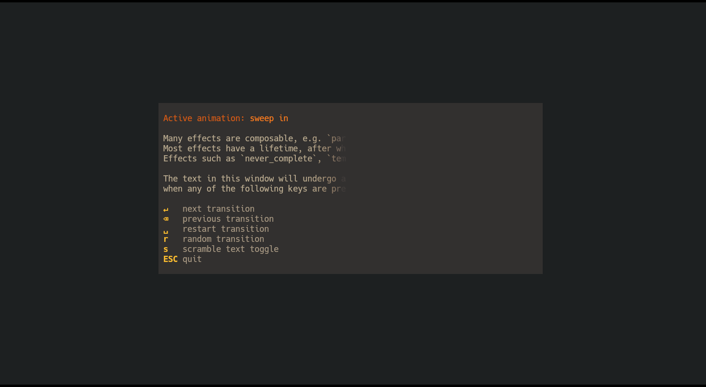

## tachyonfx

tachyonfx is a [ratatui][ratatui] library for creating shader-like effects in terminal UIs.
This library provides a collection of effects that can be used to enhance the
visual appeal of terminal applications, offering capabilities such as color
transformations, animations, and complex effect combinations.


 [ratatui]: https://ratatui.rs/

## Installation
Add tachyonfx to your `Cargo.toml`:

```toml
tachyonfx = "0.3.0"
```

## Overview


### Effects

The library includes a variety of effects, categorized as follows:

#### Color Effects
- **fade_from:**      Fades from the specified background and foreground colors
- **fade_from_fg:**   Fades the foreground color from a specified color.
- **fade_to:**        Fades to the specified background and foreground colors.
- **fade_to_fg:**     Fades the foreground color to a specified color.
- **hsl_shift:**      Changes the hue, saturation, and lightness of the foreground and background colors.
- **hsl_shift_fg:**   Shifts the foreground color by the specified hue, saturation, and lightness over the specified duration.
- **term256_colors:** Downsamples to 256 color mode.

#### Text/Character Effects
- **coalesce:**   The reverse of dissolve, coalesces text over the specified duration.
- **dissolve:**   Dissolves the current text over the specified duration.
- **slide_in:**   Applies a directional sliding in effect to terminal cells.
- **slide_out:**  Applies a directional sliding out effect to terminal cells.
- **sweep_in:**   Sweeps in from the specified color.
- **sweep_out:**  Sweeps out to the specified color.

#### Timing and Control Effects
- **consume_tick:**         Consumes a single tick.
- **never_complete:**       Makes an effect run indefinitely.
- **ping_pong:**            Plays the effect forwards and then backwards.
- **repeat:**               Repeats an effect indefinitely or for a specified number of times or duration.
- **repeating:**            Repeats the effect indefinitely.
- **sleep:**                Pauses for a specified duration.
- **timed_never_complete:** Creates an effect that runs indefinitely but has an enforced duration.
- **with_duration:**        Wraps an effect and enforces a duration on it.

#### Geometry Effects
- **translate:**   Moves the effect area by a specified amount.
- **resize_area:** Resizes the area of the wrapped effect.

 
#### Combination Effects
- **parallel:** Runs effects in parallel, all at the same time. Reports completion once all effects have completed.
- **sequence:** Runs effects in sequence, one after the other. Reports completion once the last effect has completed.

#### Other Effects
- **effect_fn:** Creates custom effects from user-defined functions, operating over `CellIterator`.
- **effect_fn_buf:** Creates custom effects from functions, operating over `Buffer`.


### EffectTimer and Interpolations

The EffectTimer is used to control the duration and interpolation of effects. It
allows for precise timing and synchronization of visual effects within your application.

### Cell Selection and Area

Effects can be applied to specific cells in the terminal UI, allowing for targeted visual
modifications and animations.

```rust
// only apply to cells with `Light2` foreground color
fx::sweep_in(Direction::UpToDown, 15, Dark0, timer)
    .with_cell_selection(CellFilter::FgColor(Light2.into()))
```

`CellFilter`s can be combined to form complex selection criteria.

```rust
// apply effect to cells on the outer border of the area
let margin = Margin::new(1, 1);
let border_text = CellFilter::AllOf(vec![
    CellFilter::Outer(margin),
    CellFilter::Text
]);

sequence(vec![
    with_duration(duration, never_complete(fx::fade_to(Dark0, Dark0, 0))),
    fx::fade_from(Dark0, Dark0, (320, QuadOut)),
]).with_cell_selection(border_text)
```

## Examples

### Example: `tweens`


```
cargo run --release --example=tweens 
```

### Example: `basic-effects`

```
cargo run --release --example=basic-effects 
```


### Example: `open-window`

```
cargo run --release --example=open-window  
```
